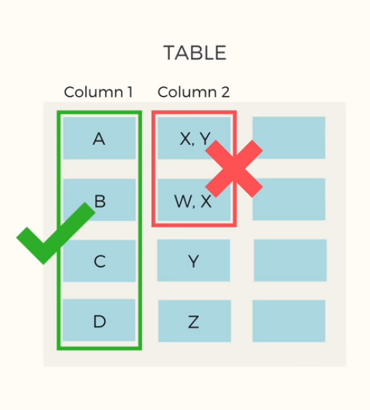
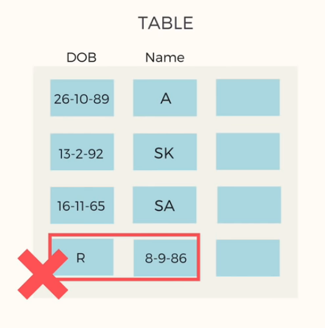
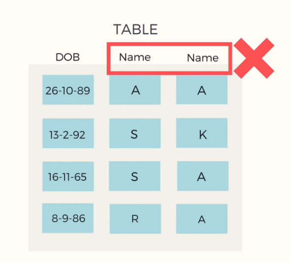

# Database 
## Functional Dependency
- If, A -> B we get a definite value of B for each A

Example: for functional dependency to exists,for each a from A, if a1 == a2 then b1 == b2 (b1,b2 from B)
- Example of not a functional dependency:  

| A | B |
| :------------- | :----------: |
| a | 1 |
| a | 2 |
| b | 3 |
| c | 4 |

Checking functional dependency:
- Check if all records are unique or not. it they are unique then, no need to check. They are functionaly independent
## Normalization
- Removes repition of similar data on multiple places
- Data redundancy uses extra spaces
- Resundancy also leads to insertion, update and deletion anomaly
- Aim is to minimize data redundancy
- Sample table:  

| Roll no       | Name     | Age     | Roll ID     | Dept     | HOD Name     | HOD Phone     | 
| :------------- | :----------: |  :----------: |  :----------: |  :----------: |  :----------: |  :----------: | 
|1 | A | 20 | 101  | CSE  | John Doe | 01800000000|
|2 | B | 22 | 102  | CSE  | John Doe | 01800000000|

## 1NF
- Each column should contain atomic value
 
- Each column should contain values that are of the same type
 
- Each column should have a unique name

**Anomaly:**
- Insertion anomaly: whenever we try to update one record, we need to add duplicate data
- Deletion anomaly: Deletion of all CSE students will lead to complete annihilation of all CSE department data
- Update anomaly: If the HOD of CSE get's changed then we need to update every CSE record

## Data model
### Conceptual Model

- Highly abstract
- Only Entities are visible
- Abstract relationship

### Logical Data Model

- Presence of attributes for each entity
- Key attributes and Non-key attributes
- Database agnostic (doesn't depend on any specific database)

### Physical Data Model

- Entities are referred to as Tables
- Attributes are refferred to as Columns
- Database compatible table names
- Data type
- Will inlcude indexes, constraints, triggers and other data objects

## Resources used
- [Normalization - KNOWLEDGE GATE](https://youtu.be/oylHRgBDfNc)
- https://youtu.be/RJ9TpkWKyU0
- [Normalization](https://www.youtube.com/playlist?list=PLLGlmW7jT-nTr1ory9o2MgsOmmx2w8FB3)
